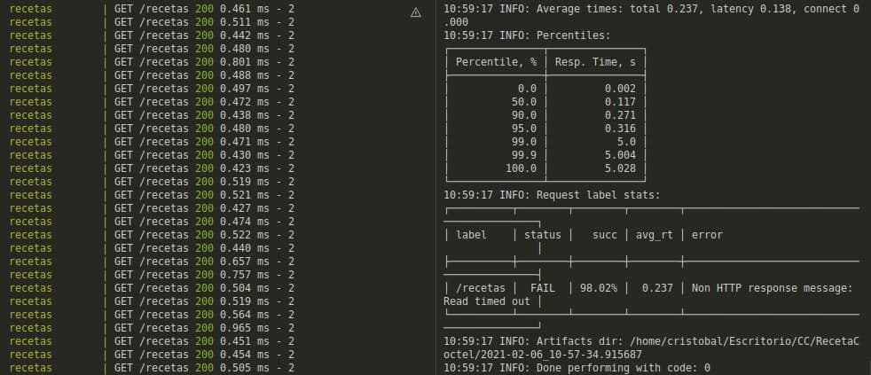

# RecetaCoctel

Proyecto para la asignatura de Cloud Computing I 

  [](https://travis-ci.com/cr13/RecetaCoctel) 
[](https://github.com/cr13/RecetaCoctel/actions)  [](https://app.circleci.com/pipelines/github/cr13/RecetaCoctel?branch=main)

## Documentación y justificación de la estructura del cluster

La idea inicial era haber creado las historias de usuario correspondiente y haber creado la clase de usuario y con ello tendría dos servicios independientes, teniendo por un lado el grupo de entidades recetas, ingredientes y valoracionrecetas, y por otro lado tendríamos el servicio de usuarios para el logeo.

Finalmente, por hacer algo con sentido para utilizar docker-compose para la ejecución de un microservicio, lo que se ha hecho ha sido crear un clúster, el cual va ha ejecutar el microservicio que se ha desarrollado junto con nginx que hará de balanceador de carga, para ello se ha creado un respaldo del microservicio, para darle sentido a la utilización de utilizar un balanceador de carga. Además se ha utilizado nginx como proxy.


## Documentación y justificación de la configuración de cada uno de los contenedores del cluster

Como se ha dicho en el punto anterior, se han creado 3 microservicios, aunque uno es una replica.

**El primer microservicio**, es el creado en el entrega anterior. Este microservicio es el encargado de servir las recetas, ingredientes y valoraciones. Sobre el Dockerfile creado en el entrega anterior se han realizado unas pequeñas modificaciónes, la primera ha sido la ejecución llamando a grunt start en vez de a grunt test. Ver [aquí](https://github.com/cr13/RecetaCoctel/commit/154bf88863fa8beb66b460a3abe3436904c269b9#diff-8b621a1fb64a284556b9cde1ba473777f543f8463d9e09105c5862fc9d3953fd). La segunda modificación que se ha realizado ha sido para añadir los directorios y cambios necesarios para mostrar un frontend básico para la ruta raíz. Ver [aquí]()

El microservicio recetascoctel se va ha servir en el puerto 3013 y su replica en el 3014.

[DockerFile](./deploy.Dockerfile) utilizado.


**El segundo servicio**, ha sido nginx para el cual se ha utilizado la imagen nginx:alpine. Ya que esta imagen es la más optimizada y la había utilizado en otros proyectos. Además se han creado dos volumenes uno para la configuración del mismo y otro para log.

Para la configuración de nginx se ha creado un fichero llamado [nginx.conf](./nginx.conf). En este fichero se hace uso de [upstream](http://nginx.org/en/docs/http/ngx_http_upstream_module.html), que se utiliza para crear un de grupos de servidores, en mi caso contiene dos servidores (Producción y una réplica) y se le ha asignado para llevar acabo el balanceo [ip_hash](http://nginx.org/en/docs/http/load_balancing.html), que consiste en crear una sesión presistente entre cliente y servidor. 

El siguiente paso es definir el puerto de escucha, los dos ficheros de log que se van a generar uno para los accesos y otro para los errores. Además definimos las redirecciones proxy que queremos que nginx ejecute y configuración de dicho proxy.

## Documentación del fichero de composición

Para el fichero de composición lo primero que se ha hecho a sido crear un fichero de entorno para ocultar los puertos a utilizar, por seguridad.

Se han creado 3 servicios y un volumen raíz.

Para los dos microservicios se ha utilizado el dockerfile deploy.Dockerfile para crear el contenedor, el puerto utilizado para cada microservico es definido en el fichero de entorno y es mapeado al puerto interno 3010.

El otro servicio es nginx el cual va utilizar la image: nginx:alpine como se ha comentado en el punto anterior, se van a crear dos volumes para la configuración y para los logs. Se incluye la referencia "link" a los dos microservicios a balancear y se define y mapea el puerto de escucha a utilizar en este caso  el 8080.

Ver composición del docker-compose [aquí](./docker-compose.yml).

Para su ejecución:

```bash

docker-compose up

```

## Testeo de la composición

#### Test utilizando Integración Continua

Para este test se ha utilizado Travis. Para ello se ha modificado el fichero [.travis.yml](./.travis.yml) creado en entregas anteriores añadiendo las lineas que podemos ver en este [commit](https://github.com/cr13/RecetaCoctel/commit/879c248ed5e3537ba3a87070a0f6d4ebe9c34dd5#diff-6ac3f79fc25d95cd1e3d51da53a4b21b939437392578a35ae8cd6d5366ca5485). 

Finalmente se añaden tres peticiones Get:
    1. Para testear el acceso a través del servicio nginx.
    2. Para testear el acceso al microsercio.
    3. Para testear el acceso a la replica del microsercio.


En Travis hay que crear las tres variables de entorno que se utilizan. Para ello hay que pulsar en More options --> settings --> Environment Variables.

#### Test de rendimiento realizado

Para el testeo de rendimiento se ha utilizado la herramienta [taurus](https://gettaurus.org/).

Siguiendo los pasos que indica en su web oficial, se ha creado el fichero [taurus-rendimiento.yml] (https://github.com/cr13/RecetaCoctel/commit/aca680c43e158479914f71e8b0c0759935e1ade2#diff-8c7244f9a89fcbccf635ca7aed8d22c4a617c27adc7edbc1452111f71e4b6659)

El cual va ha realizar un test con una concurrencia de 100 peticiones durante un minuto, obteniendo el siguiente resultado:



Como se puede observar en la imagen de la derecha se han obtenido buenos tiempos de respuesta y una tasa de satisfacción del 98.02%.

Aparte de esta prueba se han realizado varias pruebas más, variando los tiempos y las peticiones que se realizan y se observan que los tiempo incrementan pero creo que es algo natural y la tasa de satisfacción oscilan entre el 96% y el 98.8%. 

En la imagen de la derecha se observan las peticiones que se están recibiendo. Para ver el funcionamiento correcto de nginx se aconseja utilizar pesos en la definición de los servidores en nginx.conf. Por ejemplo:

```bash
upstream recetascotelservice {
	ip_hash;
	server recetas:3010  weight=3 ;
	server recetas_aux:3010  weight=3;
}

```

## Despliegue 

Para el despliegue se ha utilizado una plataforma Paas, en concreto [Heroku](https://dashboard.heroku.com/). Se ha desplegado de dos formas distintas, una subiendo la aplicación y ejecutandola, y la otra forma creando y usando contenedores. Ver [aquí.](https://cr13.github.io/RecetaCoctel/heroku.html)

La aplicación se puede visitar en [recetacoctel.herokuapp.com/](https://recetacoctel.herokuapp.com/)


 
## Avance del proyecto

- Se han corregido las sugerencias en la corrección del entrega anterior.
    - Correspondiente a la issue [Comprobar todos los tipos que se pueda](https://github.com/cr13/RecetaCoctel/issues/35)

- Se ha creado un frontend básico para que al acceder a través de heroku se vea que el delpligue esta funcionando correctamente.
    - [Vista](https://github.com/cr13/RecetaCoctel/commit/be76ad734219a029217a3b626b6f4f8805ceb12a) desarrollada en Jade.
    - [Hoja de estilo](https://github.com/cr13/RecetaCoctel/commit/da24b5604d14e57e7e346aa8062457c2a785089e)        
    - Actualización de [app.js](https://github.com/cr13/RecetaCoctel/commit/e702db4fbdbd3c3b6ff731a05994c1d95ced6c96) para que utilice jade y dar acceso a la hoja de estilos.
    - Instalación de los paquetes necesarios ver en [package.json](https://github.com/cr13/RecetaCoctel/commit/41c3ce9c612632d6bfedb9efde05246fc88df4cb).
    - Se crear [ruta raíz](https://github.com/cr13/RecetaCoctel/commit/5690b1a9866c9aa5c0d143d6184bf4ebef110cde).

<!--
- Lo primero que se ha realizado ha sido añadir el control de tipos en los parámetros de las clases.
    - [5d14a28](https://github.com/cr13/RecetaCoctel/commit/5d14a28aa9c2263447b1a82cca6b84b5cf447cf9)
    - [f51a60f](https://github.com/cr13/RecetaCoctel/commit/f51a60ffe13dc51fc5f6d48740338dd2abd6a611)
    - [b730205](https://github.com/cr13/RecetaCoctel/commit/f51a60ffe13dc51fc5f6d48740338dd2abd6a611)
- Se ha cambiado la forma de almacenamiento en las clases controladoras cambiando los arrays por diccionarios para mejorar la eficiencia de accesos a los datos.
    - [4fd7672](https://github.com/cr13/RecetaCoctel/commit/4fd76723d8bc75f94d135fc44a358d5cae57c417)
- Debido a la mejora anterior se han tenido que modificar los métodos relacionados.
    - [Consultar](https://github.com/cr13/RecetaCoctel/issues/5) receta.
    - [Añadir](https://github.com/cr13/RecetaCoctel/issues/6)
    - [Eliminar](https://github.com/cr13/RecetaCoctel/issues/8)
- Además se han tenido que corregir todos los test.

    Receta
    - [2215d1f](https://github.com/cr13/RecetaCoctel/commit/2215d1f1a5cd41bb5825e012fb20ca145383b162)
    
    Clase controladora de receta
        - Añadir una receta[8488955](https://github.com/cr13/RecetaCoctel/commit/8488955afc22ceb0efe83a11b6be3a64d9fdb2d9)
        - Búsqueda por titulo [9cc9036](https://github.com/cr13/RecetaCoctel/commit/9cc9036ed153fc032520e32a709f87c241ea9471)
    
    Ingredientes
        - [2215d1f ](https://github.com/cr13/RecetaCoctel/commit/8af3cd95097fbeabca1ba40becba7b512bb76bf4#diff-944456afa8b87a27520cc9bb37b45391c6c68777cbd9f48e3dd062a32dcd7490)

    Clase controladora de ingredientes
    - [98efc94 ](https://github.com/cr13/RecetaCoctel/commit/98efc9427a050e118167b255ea6dc494b9107006)

    Test para probar las rutas
    - Ver de forma desglosada [aquí](https://cr13.github.io/RecetaCoctel/diseñoTest.html#testapi)
    
- Se ha actualizado el [fichero](https://github.com/cr13/RecetaCoctel/commit/c8a2305dbd193556e6391ffd36aa76fa3ae425c8) de Travis para quitar las versiones innecesarias y dejar solo las importantes, de esta forma se consumen menos créditos Travis.
- Se han eliminado los comentarios del fichero [Dockerfile](https://github.com/cr13/RecetaCoctel/issues/31)
- Se ha añadido una clase para las [Excepciones](https://github.com/cr13/RecetaCoctel/issues/29) -->


### Documentación

1. [Configuración del repositorio.](./doc/doc_H0.md)
2. [Descripción del problema](./doc/desc_prob.md)
3. [Definición de la arquitectura elegida.](https://cr13.github.io/RecetaCoctel/)
4. [Planificación del proyecto (ROADMAP)](https://cr13.github.io/RecetaCoctel/Roadmap.html)
5. [Historias de usuario](https://cr13.github.io/RecetaCoctel/hu.html)
6. [Clases desarrolladas.](https://cr13.github.io/RecetaCoctel/clases_desarrolladas.html)
7. [Elección y justificación de biblioteca de aserciones y sistema de pruebas.](https://cr13.github.io/RecetaCoctel/aserciones_sis_pruebas.html)
8. [Gestor de tareas](https://cr13.github.io/RecetaCoctel/aserciones_sis_pruebas.html#item3)
9. [Elección correcta, justificada del contenedor base y Dockerfile desarrollado](https://cr13.github.io/RecetaCoctel/contenedor.html)
10. [Subida a Docker Hub](https://cr13.github.io/RecetaCoctel/docker_hub.html)
11. [Uso de GitHub Container Registry](https://cr13.github.io/RecetaCoctel/githubcontainerregistry.html)
12. [Sistemas de Integración Continua](https://cr13.github.io/RecetaCoctel/ci.html)
13. [Justificación técnica del framework elegido para el microservicio.](https://cr13.github.io/RecetaCoctel/frameworkAPI.html).
14. [Diseño en general del API.](https://cr13.github.io/RecetaCoctel/diseñoAPI.html).
15. [Uso de buenas prácticas: configuración distribuida, logs.](https://cr13.github.io/RecetaCoctel/bnpracticas.html).
16. [Diseño de los test.](https://cr13.github.io/RecetaCoctel/diseñoTest.html).
17. [Otros trabajos](./deploy.Dockerfile)

