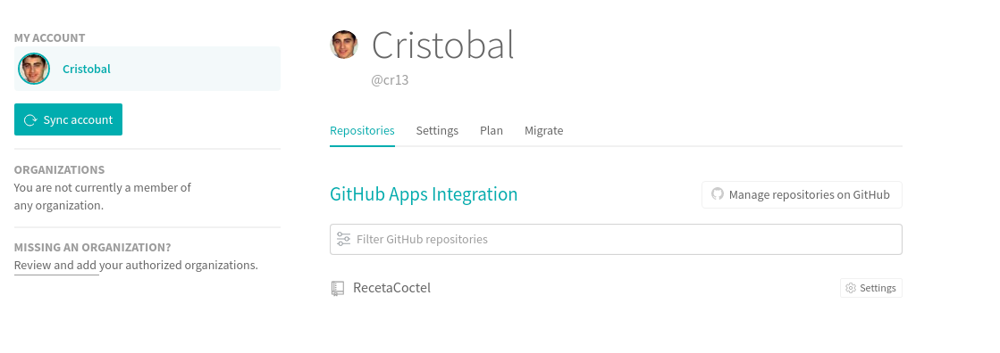
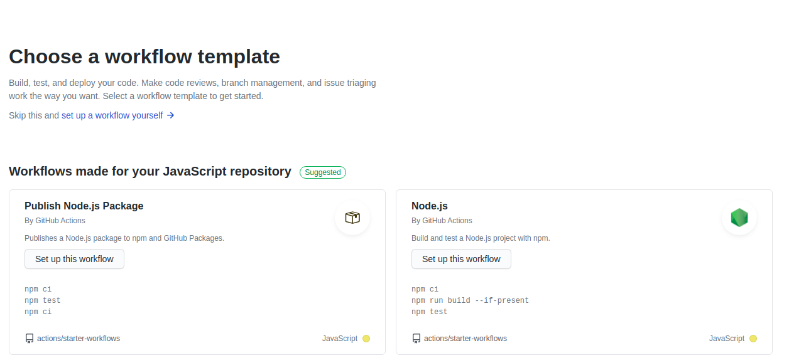
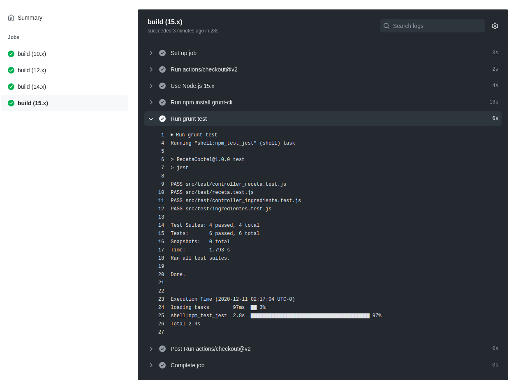
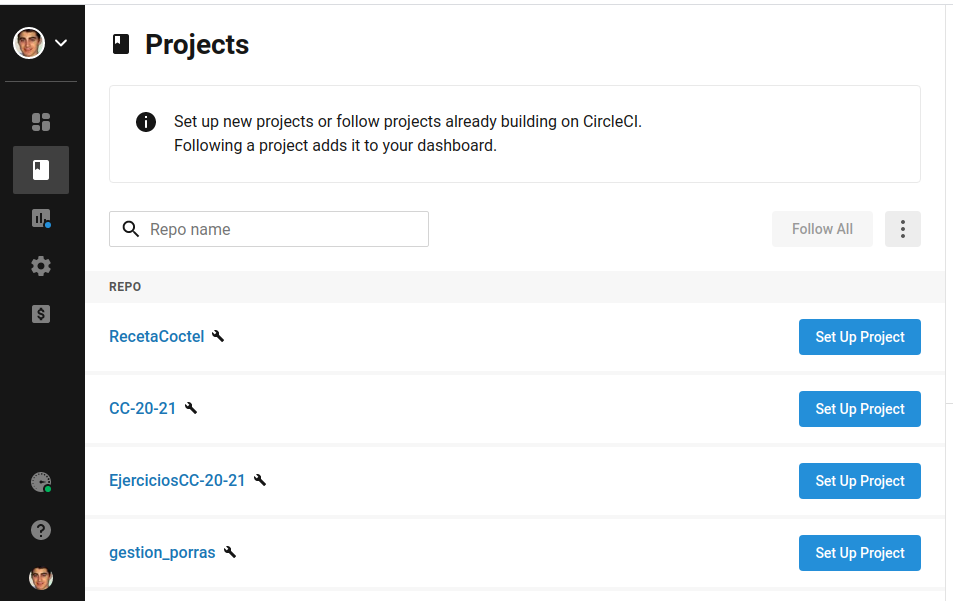
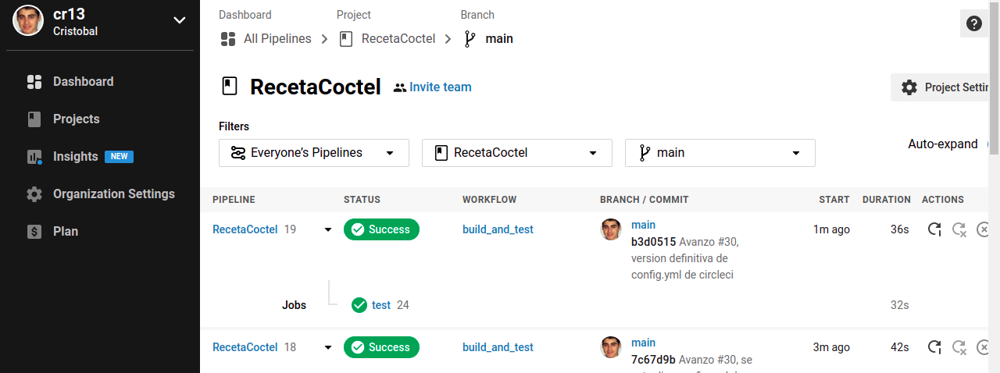
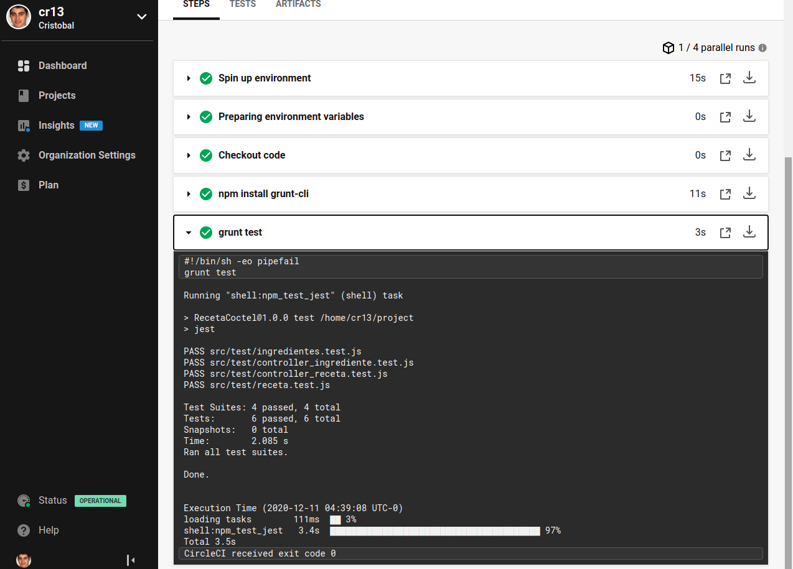

###### [Inicio](./) | [Roadmap](./Roadmap.html) | [HU](./hu.html) | [Tools Test](./aserciones_sis_pruebas.html) | [Contenedor](./contenedor.html) | [GitHubContainerRegistry](./githubcontainerregistry.html) | [CI](./ci.html)


# Sistemas de integración continua

Para llevar a cabo la integración continua de mi proyecto, se va a probar:

1. [Travis-ci](https://travis-ci.com/) donde se van a testear en las versiones más recientes de NodeJS, justificación de uso [aquí](./ci.html#travisci)

2. GitHub Actions CI donde se probaran dos versiones antiguas de NodeJS, ver justificación [aquí](./ci.html#actionsci)

3. [**CircleCI**](https://circleci.com/) donde utilizaremos un contenedor docker para realizar los test, justificación de uso [aquí](./ci.html#circleci). 

<a name="travisci"></a>

### Travis-CI

En primer lugar vamos a utilizar **Travis-ci**, pero vamos a registrarnos en [travis-ci.com](https://travis-ci.com/) dado que [travis-ci.org](https://travis-ci.org/) se ha utilizado en los [ejercicios](https://github.com/cr13/EjerciciosCC-20-21/blob/main/tema4.md) y que además va ha dejar de funcionar a final de este mes (12-2020).

Siguiendo las [instrucciones](https://travis-ci.com/getting_started), lo primero que vamos a realizar va ser activar los repositorios en los que queremos tener acceso desde travis. Da dos opciones:
- Todos los repositorios actuales y futuros
- Seleccionar los repositorios.



Yo he elegido la segunda opción, para elegir el repositorio solo el repositorio del proyecto al que quiero dar acceso a travis.

Entonces, seleccionamos nuestro repositorio del proyecto y pasamos al siguiente paso que es añadir el fichero de configuración de travis llamado [.travis.yml](https://github.com/cr13/RecetaCoctel/blob/main/.travis.yml), el cuál vamos a explicar a continuación.

En primer lugar vamos a especificar el lenguaje de nuestro proyecto. Con esto ya sería suficiente para que travis realice su cometido automáticamente.

```bash

language: node_js

``` 
A partir de aquí ya son todo configuraciones que se han añadido, por ejemplo, aunque por defecto las notificaciones vienen desactivadas, he añadido la sentencia para ver que si en vez de poner false ponemos nuestro correo nos van a llegar las notificaciones de los test realizado.

```bash

notifications:
  email: false   # Ej:  email: cr13@correo.ugr.es 
``` 
En la siguiente configuración vamos a indicar las versiones de NodeJS en las que vamos a probar nuestro proyecto. He añadido 4 formas diferentes de indicar las versiones, que son:

```bash

node_js:
  - node        # La versión actual más estable
  - lts/*       # La versión actual más estable con soporte a largo plazo
  - "v15.0.1"   # Se especifica una versión en concreto, la 15.0.1
  - "12"        # Se especifica una versión, que por defecto sería la versión 12 más actual estable lst 

``` 
Ahora vamos a especificar que nos instale nuestro gestor de tareas.

```bash

before_install:
  - npm install grunt-cli

``` 
Este paso no es necesario, pero en mi proyecto para las versiones lts, me solicita realizar npm install para continuar (motivo necesita instalar la dependencia node express). Por ello, ejecutamos la tarea grunt install la cuál se va encargar de realizar un npm install, tarea especificada en el [gruntfile](https://github.com/cr13/RecetaCoctel/blob/main/Gruntfile.js) del proyecto.

```bash
install:
  - grunt install
``` 
Y por último lanzamos los test a través del gestor de tareas.

```bash

script: grunt test

``` 

Para finalizar nuestra instalación de integración continua con travis vamos añadir en el README del repositorio el badge de estado con la siguiente linea markdown. Ver en [ejercicios](https://github.com/cr13/EjerciciosCC-20-21/blob/main/tema4.md) tema 4 como localizar el enlace. 

```bash

[](https://travis-ci.com/cr13/RecetaCoctel)


``` 
Otra configuración interesante sería seleccionar el entorno de virtualización a utilizar, [documentación](https://docs.travis-ci.com/user/reference/overview/) por si en el futuro se quieren probar el proyecto en diferentes entornos.

También se incluye [documentación](https://docs.travis-ci.com/user/migrate/open-source-repository-migration) para migrar los repositorios a travis-ci.com

**Referencias seguidas:**

[Temario integración continua](http://jj.github.io/CC/documentos/temas/Integracion_continua)

[Tutorial de Travis + NodeJS + grunt](https://sites.google.com/site/practicadesarrollosoft/temario/continuous-integration/ci---travis)

[Documentación travis para javascript con NodeJS](https://docs.travis-ci.com/user/languages/javascript-with-nodejs/)

[Configuración de travis.yml](https://nodejs.medium.com/choosing-the-node-js-versions-for-your-ci-tests-hint-use-lts-89b67f68d7ca)

[Grunt en Travis](https://gist.github.com/travishorn/5869188)

[Notificaciones](https://docs.travis-ci.com/user/notifications/)

<a name="actionsci"></a>

### Github Actions CI

Como en la practica anterior ya integramos algunas github actions, el proceso que vamos a realizar es el mismo, desde la interfaz de github vamos a la pestaña **Actions** y pulsamos en **New rokflow**.

Nos aparece un listado de plantillas de flujos de trabajos, nosotros elegimos el de  **NodeJS "Build and test a Node.js project with npm."** y lo instalamos. 



Esto nos lleva a la ventana de edición del fichero yml.

Podemos hacer dos cosas:
- Editarlo y realizar el commit desde la interfaz gráfica 
- Copiar el contenido del fichero y crearlo de manera manual en nuestro repositorio local el fichero .yml

Una vez decidida una de las dos formas pasamos a modificar el código del [fichero.yml](https://github.com/cr13/RecetaCoctel/blob/main/.github/workflows/node.js.yml). 

Indicamos el nombre de nuestro flujo de trabajo

```bash
name: Node.js CI
```
Podemos indicar el entono de virtualización 

```bash
runs-on: ubuntu-latest
```
Para especificar las versiones de node utilizamos.

```bash

node-version: [10.x, 14.x]

```
Para finalizar modificamos las tareas de ejecución, para instalar nuestro gestor de tareas y lanzar los test

```bash
run: npm install grunt-cli
run: grunt test
```

A continuación se muestra el resultado




Para finalizar se añade el badge en el Readme del repositorio

```bash
[](https://github.com/cr13/RecetaCoctel/actions)
```

**Referencias seguidas:**

[doc testing nodjs](https://docs.github.com/en/free-pro-team@latest/actions/guides/building-and-testing-nodejs)


<a name="circleci"></a>

### CircleCI

En esta alternativa siguiendo las buenas prácticas recomendadas en el temario vamos a utilizar contenedores para acelerar los tests.

Lo primero que vamos a hacer es darnos de alta, nos da la posibilidad de registrarnos a través de Github o de Bitbucket. Como es lógico nosotros utilizamos Github.

Una vez que damos permiso para acceder a nuestros repositorios de Github nos aparece un listado con nuestros repositorios para activar el que queramos. en nuestro caso RecetaCoctel.



Una vez pulsamos en el botón **Set Up Project** nos aparece un fichero de configuración generado automáticamente. Con esto solo deberíamos pulsar en añadir y ya lo tendríamos funcionando.


Como lo que queremos es ejecutar los test utilizando nuestro contenedor, pasamos a realizarlo de forma manual. Para ello, pulsamos en **Use Existing Config** y nos descargamos el archivo de configuración el cual debemos añadir en nuestro repositorio en la ruta indicada [.circleci/config.yml](https://github.com/cr13/RecetaCoctel/blob/main/.circleci/config.yml)

Siguiendo el [ejemplo](https://circleci.com/docs/2.0/sample-config/), se ha creado la versión del archivo de configuración. Como dato a tener en cuenta, para crear las variables de entorno en circleCI, cuando estamos dentro del proyecto, nos vamos a **Poject Setting** --> **Environment Variables**.

Una vez creado, configurado una primera versión del fichero [config.yml](), lo subimos al repositorio, entonces volvemos al circleci pulsamos de nuevo en **Set Up Project** --> **Use Existing Config** --> **Start Building**

Entonces empezara a ejecutar el fichero de configuración, como podemos observar en la siguiente imagen, se muestra el panel de ejecuciones de nuestro proyecto:



Si pulsamos en las letras verdes test (en caso de error estaría en rojo), accedemos al proceso realizado.




Para finalizar se va añadir el badge de circleCI al repositorio con la siguiente linea.

```bash
[](https://app.circleci.com/pipelines/github/cr13/RecetaCoctel?branch=main)
```

**Referencias seguidas:**

[Docmentación de ejemplo de configuración](https://circleci.com/docs/2.0/sample-config/)


Para generar los badge se ha utilizado la siguiente [web](https://shields.io/).


