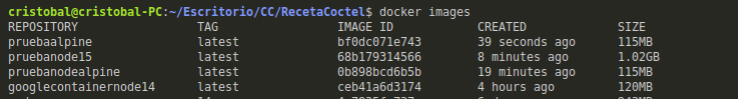
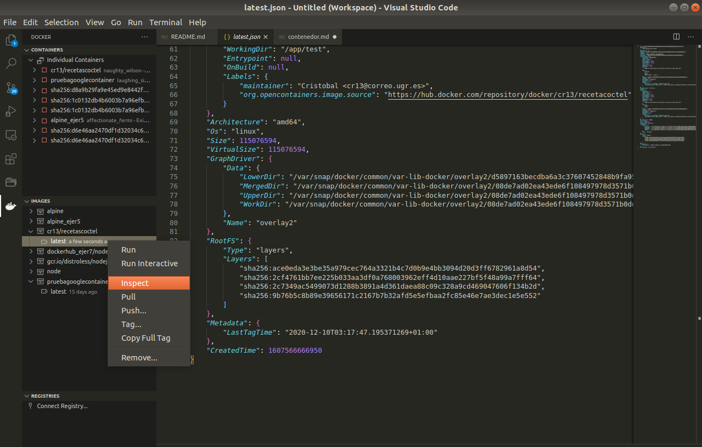

###### [Inicio](./) | [Roadmap](./Roadmap.html) | [HU](./hu.html) | [Clases](./clases_desarrolladas) | [Tools Test](./aserciones_sis_pruebas.html) | [Docker Hub](./docker_hub.html) | [GitHubContainerRegistry](./githubcontainerregistry.html) | [CI](./ci.html) | [Framework API](./frameworkAPI.html)

## Elección correcta y justificada del contenedor base y construcción de Dockerfile

Para la elección del contenedor base, se ha tenido en cuenta todo lo aprendido en los [ejercicios](https://github.com/cr13/EjerciciosCC-20-21/blob/main/tema3.md) del temario, ya que en ellos se han instalado y aprendido a valorar varias imágenes base. También se han tenido en cuenta las buenas prácticas, donde aconsejan que la imagen debe ser ligera, con el número mínimo de capas posible y a ser posible usar una imagen de un proveedor de confianza ya que nos garantiza un nivel alto de seguridad, mantenibilidad y seguramente sera lo más liviana posible en cuanto a espacio.

Durante los ejercicio, al realizar los pequeños proyectos en NodeJs, me tope con una imagen oficial de NodeJS instalada en la imagen alpine que es la más liviana que existe hasta el momento. Y puesto que este punto es un poco de investigación me he encontrado con otro buen exponente [Google Distroless Docker Images](https://github.com/GoogleContainerTools/distroless) que son imágenes que solo contienen la aplicación y sus dependencias de tiempo de ejecución. Esta version se ha descartado porque realiza una construcción en dos fases, lo cual se hablo en clase que no valía para nuestro proyecto. Aún asi se va a probar y comparar con las imágenes alpine, node:15.2.1-alpine3.10 y node:15.

A continuación se muestra una captura de las imágenes que vamos a probar.

<!--  -->




Como se puede observar en la ilustración, la prueba de node:15 es la que más ocupa por lo que ya estaríamos incumpliendo las buenas practicas. Entonces nos quedarían nodealpine y alpine que ocupan prácticamente lo mismo. 
La prueba de google no es que ocupe mucho mas que las dos que vamos a elegir, pero no esta disponible en la última versión de node y se construye en dos fases aunque en la captura no aparece, para construir la imagen googlecontainernode14 se hace a partir de una imagen llamada gcr.io/distroless/nodejs con un tamaño similar (119MB).

Después de este cribado que se ha realizado nos queda nodealpine15 y alpine. Ahora vamos a comprobar el numero de capas que tiene cada una. Para ello, podemos usar la herramienta jq vista en los [ejercicios del tema 3](https://github.com/cr13/EjerciciosCC-20-21/blob/main/tema3.md) o como yo lo he consulado, utilizando el plugins Docker de visual code. 

- alpine --> 7 capas
- node:15.2.1-alpine3.10  --> 10 capas
- node:15 --> 14 capas
- googlecontainernode14 --> 5 capas

Se va intentar mejorar el Dockerfile para intentar reducir el número de capas, pero en esta primera versión realizada, la mejor imagen en cuanto a capas sería googlecontainernode14, seguida de alpine que sería la opción que vamos a utilizar por los motivos que se han ido comentando.

Se ha conseguido mejorar al utilizar una sola sentencia RUN en el Dockerfile.

Resultado final, utilizando el plugin Docker de visual code.



Como se puede comprobar en el [Dockerfile](https://github.com/cr13/RecetaCoctel/blob/main/Dockerfile), se ha intentado seguir las buenas prácticas de forma que:

- Se ha utilizado la mejor imagen posible en cuanto a capas y tamaño.

```bash
#Imagen y versión que usaremos de base
 FROM alpine:latest
```

- El menor número de etiquetas (LABELS) y ejecuciones (RUN)

Los labels que se han añadido son para indicar el nombre del autor y el repositorio del proyecto en GitHub Container Registry para que nos conecte el repositorio con el paquete.

```bash
LABEL maintainer="Cristobal <cr13@correo.ugr.es>" \
    org.opencontainers.image.source="https://hub.docker.com/repository/docker/cr13/recetacoctel"
   
```

La ejecución consiste en instalar la última version de node y grunt-cli.
Además se ha creado un grupo de usuarios asignado el uid y no dejando que se asigne uno aleatorio, y igualmente se ha creado un usuario al cual se le ha asignado el grupo creado y especificando el shell a usar. Cumpliendo el requisito de utilizar un usuario sin privilegios. Además se van a crear los directorios de node_modules y test. Para finalizar asignamos al usuario creado de propietario del directorio app.

```bash

RUN apk add --no-cache nodejs npm \
    && npm install -g grunt-cli \
    && addgroup -g 1000 node \
    && adduser -u 1000 -G node -s /bin/sh -D cr13 \ 
    && mkdir -p /app/node_modules \
    && mkdir -p /app/test \
    && chown -R cr13:node /app
```

- Se hace uso de variables de entornos para especifica el espacio de trabajo, el cuál se ha creado en función de la sentencia de comprobación indicada en la [entrega de la práctica](http://jj.github.io/CC/documentos/proyecto/3.Docker.html)

```bash

WORKDIR /app

```

- Se utiliza COPY en vez de ADD y se copia solo los ficheros necesarios, estableciendo de propietario el usuario creado.

Los ficheros que vamos a necesitar son:
    - package.json y el package-lock.json
    - el gestor de tareas y su archivo de configuración

```bash

COPY --chown=cr13:node ["package*.json", "Gruntfile.js",".jshintrc", "./"]

```

- Se indica el usuario (sin privilegios) a utilizar para la ejecución de las tareas

```bash

USER cr13

```

- Se instala grunt de forma local, lo lógico es que se usara npm ci, ya que es lo ideal para integración continua, pero al tener instalado el framework express (el cuál no es necesario), me obliga a utilizar npm install.

```bash

RUN npm install grunt-cli && grunt install

```

- Registramos node_modules en el path para que localize las dependencias. Esto se ha realizado para evitar problemas de permisos con el usuario. Al cambiar la ruta del directorio de node_modules al directorio app del cual es propietario nuestro usuario, solucionamos los problemas de instalar grunt en local por un usuarios sin privilegios.


```bash

ENV PATH=/node_modules/.bin:$PATH

```

- Para terminar se ha utilizado CMD en vez de ENTRYPOINT y se ha definido en formato de vector en vez de string, por si en el futuro se utiliza Docker compose.

```bash

CMD ["grunt","test"]

```

### Instrucciones de uso

```bash

#Se construye la imagen
docker build -t cr13/recetascoctel .

#Para ejecutarlo
docker run -t -v `pwd`:/app/test cr13/recetascoctel

```

### Ref seguidas

- [Buenas prácticas construyendo imágenes Docker](https://medium.com/@serrodcal/buenas-pr%C3%A1cticas-construyendo-im%C3%A1genes-docker-8a4f14f7ad1d)
- [Buenas prácticas para escribir un Dockerfile](https://blog.arima.eu/es/2020/04/21/buenas-practicas-para-escribir-un-dockerfile.html)


