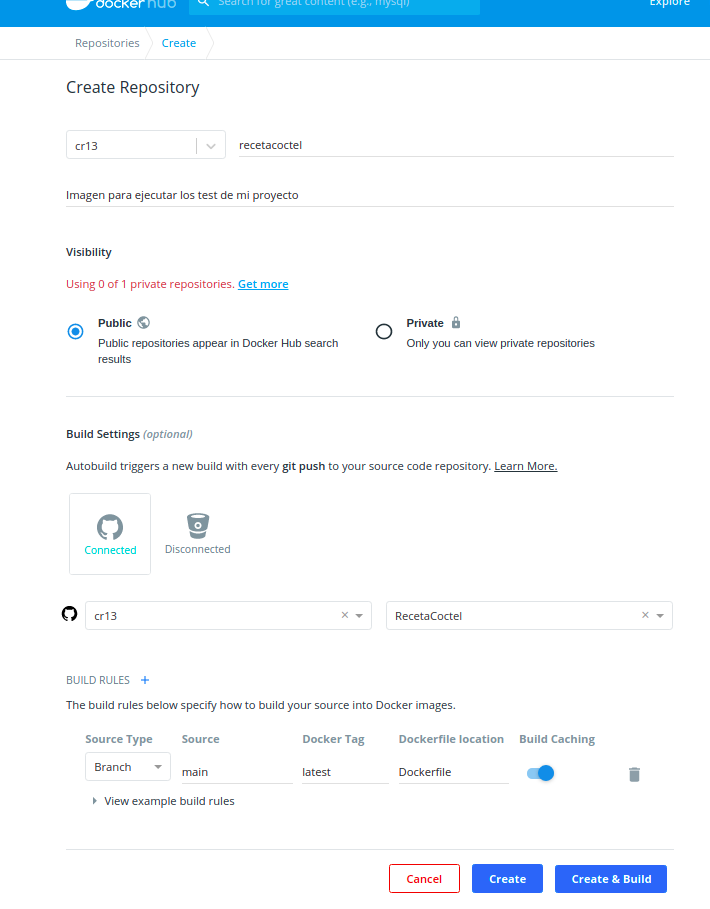

###### [Inicio](./) | [Roadmap](./Roadmap.html) | [HU](./hu.html) | [Clases](./clases_desarrolladas) | [Tools Test](./aserciones_sis_pruebas.html) | [Contenedor](./contenedor.html) | [GitHubContainerRegistry](./githubcontainerregistry.html) | [CI](./ci.html) | [Framework API](./frameworkAPI.html) | [Diseño API](./diseñoAPI.html) | [Diseño Test](./diseñoTest.html)  | [Buenas Practicas](./bnpracticas.html) 

# Subida a Docker Hub

Para poder utilizar Docker Hub, lo primero que hay que hacer es registrarse, una vez registrados hay que ir a Account Setting --> Linked Accounts y asociar nuestra cuenta de GitHub. Una vez hecho esto solo hay que crear el repositorio. En el siguiente captura se muestra la configuración de creación de mi repositorio 

A continuación dejo mi [Repositorio DockerHub](https://hub.docker.com/r/cr13/recetacoctel).