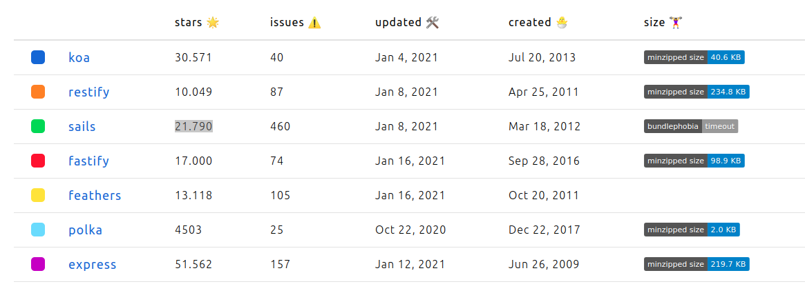
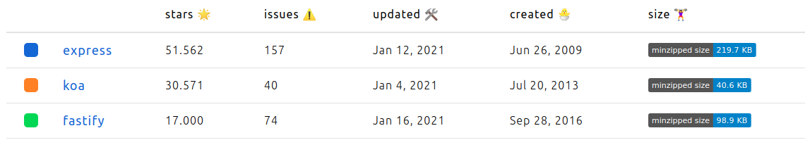
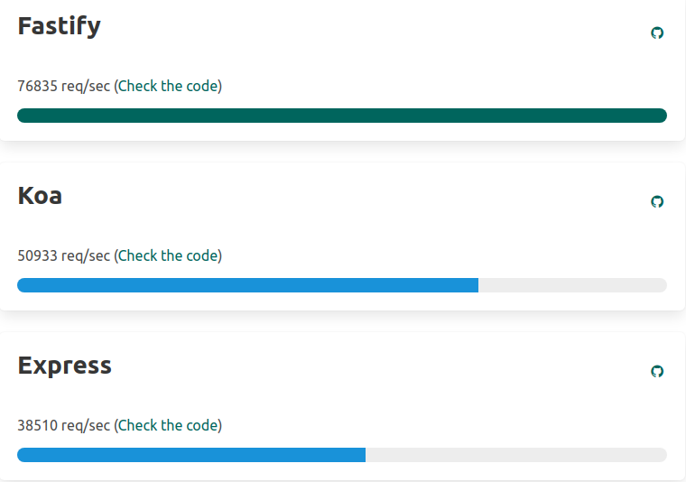

###### [Inicio](./) | [Roadmap](./Roadmap.html) | [HU](./hu.html) | [Clases](./clases_desarrolladas) | [Tools Test](./aserciones_sis_pruebas.html) | [Contenedor](./contenedor.html) | [Docker Hub](./docker_hub.html) | [GitHubContainerRegistry](./githubcontainerregistry.html) | [CI](./ci.html) | (Framework API)[./frameworkAPI.html]


## Justificación técnica del framework elegido para el microservicio.

Desde un principio se había elegido usar [Express](https://expressjs.com/es/), por su soporte y gran comunidad que le respalda, por ser el más utilizado desde hace años y estar constantemente actualizando vulnerabilidades detectadas. Después de decir esto creo que esta bastante claro cual va ser mi elección pero antes de ser la definitiva vamos a estudiar un poco otras alternativas existentes.

A continuación muestro unas estadísticas de los [frameworks](https://www.npmtrends.com/koa-vs-restify-vs-sails-vs-fastify-vs-feathers-vs-polka-vs-express) más utilizados para NodeJS.



Como podemos observar los mejor valorados son express, koa y sails, también hay que destacar que son los que más tiempo llevan y si nos fijamos, uno que parece que viene fuerte es fastify nació a finales de 2016 y se postula en estas estadísticas como el 4 mejor valorado en tan poco tiempo.

Por lo tanto, vamos a quedarnos con [express](https://expressjs.com/es/), [koa](https://github.com/koajs/koa) y [fastify](https://www.fastify.io/).



Con esta comparativa final, quiero que nos fijemos en el tamaño de cada framework, como se puede observar el más pesado es express, seguido de fastify, esto es debido a la gran cantidad de módulos que lo componen. 

Si realizamos una prueba sobre el ejemplo básico de "Hola mundo", los resultados de velocidad declaran un claro vencedor.



Los tres son fáciles de utilizar, añado el ejemplo básico de cada uno:

[Ejemplo de Express](https://expressjs.com/es/starter/hello-world.html)

```bash
#Instalación Express
npm install express

#ejemplo express_app.js
const express = require('express')
const app = express()
const port = 3002

app.get('/', (req, res) => {
  res.send('Hello World!')
})

app.listen(port, () => {
  console.log(`Example app listening at http://localhost:${port}`)
})

```

[Ejemplo de Koa](https://github.com/koajs/koa)

```bash
#Instalación koa
npm install koa

#ejemplo koa_app.js
const Koa = require('koa');
const app = new Koa();

// response
app.use(ctx => {
  ctx.body = 'Hello Koa';
});

app.listen(3004);

```

[Ejemplo de fastify](https://www.fastify.io/docs/latest/Getting-Started/)

```bash
#instalación
npm i fastify --save

#ejemplo fastify_app.js

const fastify = require('fastify')({
  logger: true
})

fastify.get('/', function (request, reply) {
  reply.send({ hello: 'world' })
})

fastify.listen(3006, function (err, address) {
  if (err) {
    fastify.log.error(err)
    process.exit(1)
  }
  fastify.log.info(`server listening on ${address}`)
})


```

Además se han probado algunos ejemplos utilizando Routes.

- [Express](https://github.com/cr13/EjerciciosCC-20-21/blob/main/tema3/ejer7-t3/express_app_routes.js)
- [Koa](https://github.com/cr13/EjerciciosCC-20-21/blob/main/tema3/ejer7-t3/koa_app_routes.js)
- [Fastify](https://github.com/cr13/EjerciciosCC-20-21/blob/main/tema3/ejer7-t3/fastify_app_routes.js)

## Conclusión

Para no hacer mas extenso esta justificación se adjuntara en la bibliografía consultada varias comparativas con ventajas y desventajas de cada framework. Al final son tres grandes frameworks y la elección de alguno de ellos va depender de lo a gusto que se sienta el programador utilizando uno u otro, por ejemplo, en mi caso aunque Fastify promete un rendimiento más rápido con una sobrecarga baja, Express me brinda una grandísima comunidad con la que me produce una gran seguridad y confianza de forma que me produce una gran comodidad trabajar con el.


## Bibliografía

- [Popularidad de frameworks seleccionados](https://www.npmtrends.com/fastify-vs-koa-vs-express)
- [Koa vs Express](https://github.com/koajs/koa/blob/master/docs/koa-vs-express.md)
- [Comparativa de express vs koa vs hapi](https://www.airpair.com/node.js/posts/nodejs-framework-comparison-express-koa-hapi#4-2-rest-api)
- [Ventajas/desventajas Express/koa](https://medium.com/@theomalaper.cognez/express-vs-koa-and-hapi-a2c65f949b78)
- [Diferencias Koa vs Fastify](https://stackshare.io/stackups/fastify-vs-koa)
- [Fastify vs. Express](https://www.educative.io/edpresso/fastify-vs-express)
- [Comparación y puntuaciones obtenidas connect vs. express vs. fastify vs. hapi vs. koa](https://npmcompare.com/compare/connect,express,fastify,hapi,koa)


