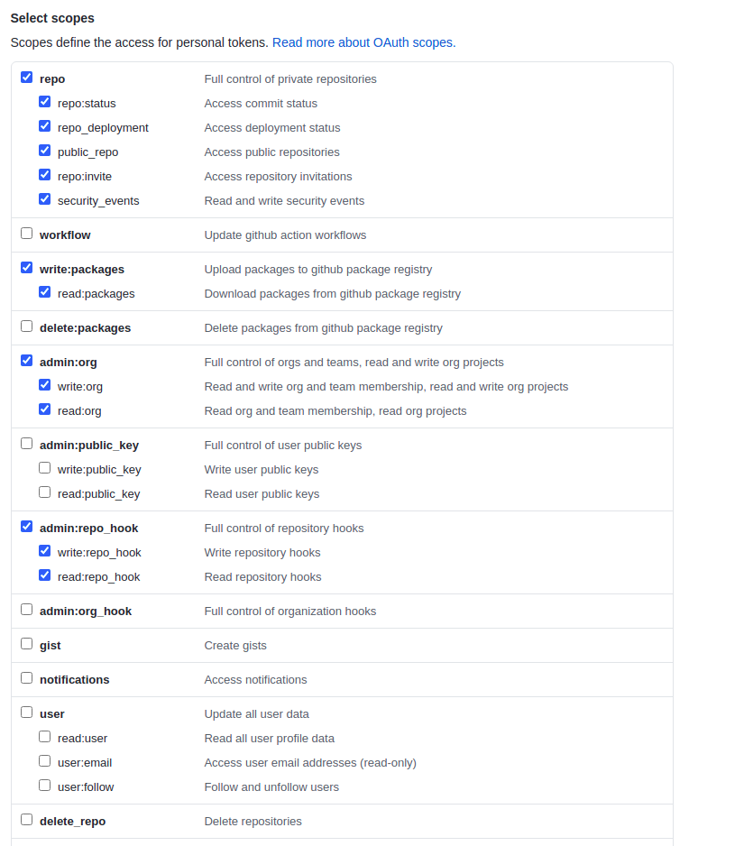
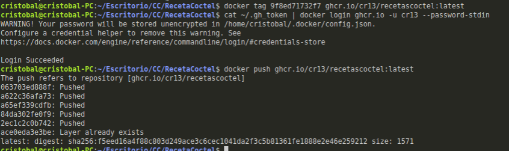
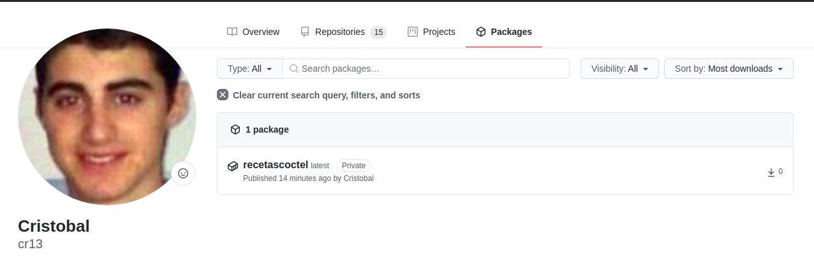
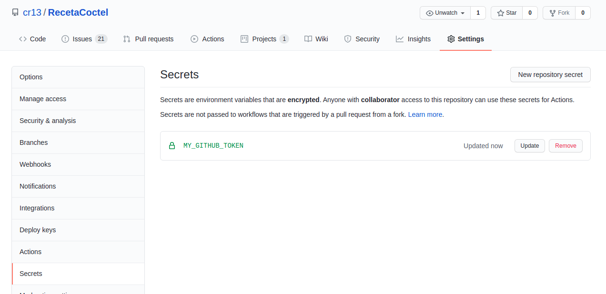

###### [Inicio](./) | [Roadmap](./Roadmap.html) | [HU](./hu.html) | [Clases](./clases_desarrolladas) | [Tools Test](./aserciones_sis_pruebas.html) | [Contenedor](./contenedor.html) | [Docker Hub](./docker_hub.html) | [CI](./ci.html) | [Framework API](./frameworkAPI.html)


## Uso de registros alternativos y públicos de contenedores.

Para este punto se va utilizar **GitHub Container Registry**, si nos vamos a la [documentación](https://docs.github.com/en/free-pro-team@latest/packages/getting-started-with-github-container-registry) oficial, nos dice que lo primero que debemos hacer para que funciones es habilitar el [soporte mejorado para contenedores](https://docs.github.com/en/free-pro-team@latest/packages/getting-started-with-github-container-registry/enabling-improved-container-support).

Para ello, nos vamos a al menú que aparece al clickar en la foto de perfil y pulsamos en **Feature preview** y habilitamos **Improved container support**.

Una vez habilitado, vamos a subir nuestra imagen de docker a github. Se van a seguir los siguientes [pasos](https://docs.github.com/es/free-pro-team@latest/packages/managing-container-images-with-github-container-registry/connecting-a-repository-to-a-container-image#connecting-a-repository-to-a-container-image-on-the-command-line)

Lo primero que se va a necesitar un token para acceder a github por consola de comandos. Se deja documentación para realizar este paso [aquí](https://docs.github.com/es/free-pro-team@latest/github/authenticating-to-github/creating-a-personal-access-token)

Permisos que se le han concedido al token



Cuando tengamos el token creado lo copiamos a un fichero en el home por ejemplo y lo llamamos con un nombre significativo. En mi caso lo voy a llamar <.gh_token>.  Otra opción es almacenarlo en una variable de entorno.

Ahora vamos a continuar con la subida de nuestra imagen, siguiendo los pasos del tutorial. Lo primero de todo, es que añadir el siguiente LABEL en el Dockerfile para que nos conecte el repositorio con el paquete.

```bash
LABEL org.opencontainers.image.source="https://hub.docker.com/repository/docker/cr13/recetacoctel"
```

Se pueden añadir más [labels](https://github.com/opencontainers/image-spec/blob/master/annotations.md#pre-defined-annotation-keys)

Para finalizar vamos a la consola y procedemos a subir nuestra imagen con los siguientes pasos.

```bash

 # Ver las imágenes docker de nuestro sistema
 docker images

# Asignamos una etiqueta a la imagen que vamos a subir
docker tag 9f8ed71732f7 ghcr.io/cr13/recetascoctel:latest

# Nos logueamos con el token en GitHub Container Registry
 cat ~/.gh_token | docker login ghcr.io -u cr13 --password-stdin

# Subimos la imagen
docker push ghcr.io/cr13/recetascoctel:latest

```



Si nos vamos a la interfaz web de gitHub, en la pestaña packages nos debe aparecer nuestra imagen. O si entramos al repositorio en el menú lateral derecho en Packages, nos debe aparecer "Publish your first package" o el nombre de nuestro paquete. 



Si deseamos publicar nuestra imagen debemos acceder a Package Setting y en Danger Zone pulsar en make public.

Por último es aconsejable crear un github actions para cuando realicemos un push en el repositorio se actualice la imagen automáticamente. 

Para ello, nos vamos a la pestaña actions de nuestro repositorio y pulsamos en new workflow. Nos aparecen una serie de templates, nosotros necesitamos el template **Publish Docker Container** que podemos localizar en el partado "Continuous integration workflows". Una vez localizado pulsamos en el botón "set up in this workflow". Se nos abre un editor y si nos fijamos en el código escrito, debemos indicar el nombre que se le va a dar a la imagen en "IMAGE_NAME" y si bajamos la linea 54 vemos secrets.GITHUB_TOKEN, el cual debemos cambiar ya que no es un nombre valido y pulsamos en start commit, automáticamente se nos crea el fichero **[docker-publish.yml](https://github.com/cr13/RecetaCoctel/blob/main/.github/workflows/docker-publish.yml)**.

Con esto ya tendríamos nuestro flujo de trabajo activo, solo nos falta añadir el secrets que hemos definido en el workflow. Para ello, vamos a Settings del repositorio --> Secrets y pulsamos en "New repository secret".

Nos aparece un formulario en el cual debemos especificar el nombre y el valor.

Nombre debe ser el mismo que vimos en el workflow, en nuestro caso "GITHUB_TOKEN".
Valor debe ser el Token, en nuestro caso vamos a reutilizar el mismo que hemos creado en este documento para subir la imagen de docker a github.

Con el github action que acabamos de crear lo que realmente hace es publicar la imagen de docker pero lo que nosotros queremos hacer es actualizar la imagen del container registry. Para ello vamos a duplicar el docker-publish.yml y añadimos los siguientes cambios:

- En la linea 54, que ya vimos anteriormente se realiza el login, entonces debemos cambiar "docker.pkg.github.com" por "ghcr.io" quedando de la siguiente forma:

```bash

docker login ghcr.io -u ${{ github.actor }} --password-stdin

```

- En la linea 58, debemos cambiar la imagen a subir reemplazando "doker.pkg.github.com/${{ github.repository }}" por "ghcr.io/${{ github.actor }}" de forma que quedaría así:


```bash

IMAGE_ID=ghcr.io/${{ github.actor }}/$IMAGE_NAME

```
Se puede ver [aquí](https://github.com/cr13/RecetaCoctel/blob/main/.github/workflows/docker-publish-container-registry.yml).

Ahora si tendríamos nuestro flujo de tarea para actualizar la imagen publicada en GitHub Container Registry ya que esta opción sustituye a Github Docker images (que es lo que hace nuestro primer workflow).

