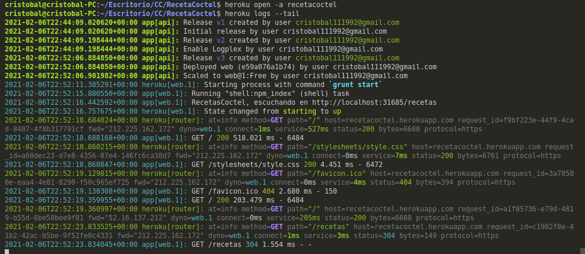

###### [Inicio](./) | [Roadmap](./Roadmap.html)  | [HU](./hu.html) | [Clases](./clases_desarrolladas) | [Tools Test](./aserciones_sis_pruebas.html) | [Contenedor](./contenedor.html) | [Docker Hub](./docker_hub.html) | [GitHubContainerRegistry](./githubcontainerregistry.html) | [CI](./ci.html) | [Framework API](./frameworkAPI.html) | [Diseño API](./diseñoAPI.html) | [Diseño Test](./diseñoTest.html)  | [Buenas Prácticas](./bnpracticas.html) | [Despliegue](./heroku.html)


## Despliegue de una aplicación en un PaaS
He utilizado la plataforma heroku, ya que la he utilizado en anteriormente, es sencillo de utilizar y hasta ahora no he tenido sorpresas como con otros servicios cloud como Amazon.

#### Ficheros necesarios para el despliegue
Para un mayor control y flexibilidad sobre su aplicación se recomienda la creación del fichero Procfile que ha de estar alojado en el directorio raíz de la aplicación. Heroku usa el Procfile para saber que tiene que ejecutar. En nuestro caso contendrá:

```bash 
web: node app.js

Para la utilización de contenedores se ha creado el fichero [heroku.yml](https://github.com/cr13/RecetaCoctel/commit/47226c8f052b5581d68ac8e24b39d55309918253), este fichero se creo para intentar desplegar el contenedor a partir de docker-compose pero sin éxito. También se ha intentado utilizar para ejecutar el heroku.Dockerfile pero sin éxito.

```


#### Instalación de  Heroku

```bash

  sudo apt-get install wget
  
  wget -O- https://toolbelt.heroku.com/install-ubuntu.sh | sh

```

#### Despligue de la app

```bash
# Nos logueamos en Heroku
  heroku login

# Creamos la aplicación, ponemos la región europea y el nombre que le vamos a asignar a nuestra app.
  heroku apps:create --region eu recetacoctel

# Generamos clave para poder subir nuestros archivos a heroku
  heroku auth:token //clave

# Creamos fichero configuración para ejecutar nuestra aplicación en heroku
  touch Profile
  # contenido Profile
  web: node app.js

# Subida de archivos a heroku
  git push heroku main #si nos pide usuario(Podemos dejarlo vacio) y la clave que acabamos de generar

#Si ya tenemos el repositorio creado
  heroku git:remote -a recetacoctel

# para subir los cambios usamos  
  git push heroku main
# Ajustamos el tipo de procesos ajustando el número de dinamómetros web a 1
  heroku ps:scale web=1
# Para ver nuestra aplicación en el navegador
  heroku open
# Para ver los posible errores que se puedan dar.
  heroku logs --tail

```


#### Despligue usando contenedores


```bash

# Nos logueamos en Heroku

heroku login

# Nos logueamos en contenedores
heroku container:login

# Creamos la app
heroku apps:create --region eu recetacoctel

# Subimos el proyecto al contenedor
heroku container:push web recetacoctel

# Lanzamos el contenedor a producción
heroku container:release web recetacoctel

# Para abrilo en el navegador
heroku open -a recetacoctelcontainer

# Para ver nuestra aplicación en el navegador
heroku open -a recetacoctelcontainer

# Para ver los posible errores que se puedan dar.
heroku logs --tail

```

La aplicación se puede visitar en [recetacoctel.herokuapp.com/](https://recetacoctel.herokuapp.com/)


A continuación se muestra el log de heroku



##### Referencias

[https://devcenter.heroku.com/articles/git#deploying-code](https://devcenter.heroku.com/articles/git#deploying-code)
[https://devcenter.heroku.com/articles/container-registry-and-runtime](https://devcenter.heroku.com/articles/container-registry-and-runtime)
[https://codigofacilito.com/articulos/deploy-heroku-container](https://codigofacilito.com/articulos/deploy-heroku-container)