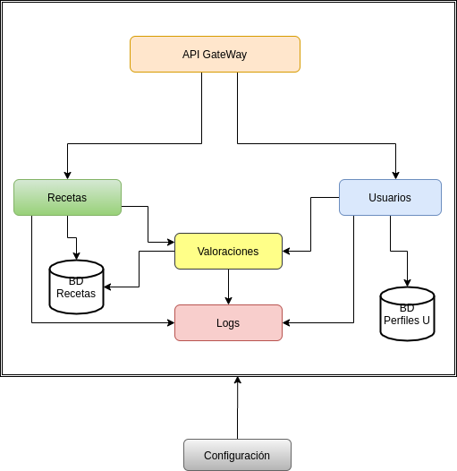

##### [Inicio](./) | [Roadmap](./Roadmap.html) | [HU](./hu.html)

# Bienvenido al buscador de recetas

## Descripción

RecetaCotel es un proyecto pensado principalmente para poder buscar recetas de cocteles, pero que en un futuro podria escalar y incluir diferentes categorias con sus correspondiente recetas.
Algunas de sus funciones se van a centrar en poder buscar receta de cocteles de forma anonima, poder dar una valoración en modo identificado.

## Arquitectura

Para la resolución del problema descrito anteriormente, se va optar por utilizar una arquitectura de microservicios, el motivo de su elección ha sido por los beneficios que nos aporta dicha arquitectura, dado que al dividir el proyecto en varios microservicios en el caso de fallo de alguno de ellos no afectaría al resto. También aporta escalabilidad, ya que se podrían desarrollar e incorporar más microservicios sin que afecte a los existentes, además de facilitar el mantenimiento de cada uno de ellos por separado. 

<!-- En el proyecto nos vamos a basar en una arquitectura basada en microservicios. Los cuales se han desglosado de la siguiente manera:

- Recetas: Microservicio que se va encargar de gestionar las peticiones de la API consultando su base de datos. En caso de no tener registros de la petición ofertada, se estudiará la posibilidad deconsultar en alguna API externa existente.

- Usuarios: Microservicio que se va encargar de gestionar los perfiles de los usarios, en ello se incluirá el logeo inicial siempre y cuando se quiera realizar algún tipo de interacción con la valoraciones de las recetas o si se quiere introducir, editar o eliminar recetas propias.

- Valoraciones: Microservicio que devolvera todas las valoraciones existentes de la receta selecionada.

- Logs: Este microservicio va a contener todos los registros identificados por estados (avisos, errores, verificaciones) de las diferentes acciones que se realicien en los microservicios anteriores.

- Configuración: Microservicio para la gestion y configuración de los difetentes microservicios de forma remota.
 -->
<!-- A continuación podemos ver el diagrama de la arquitectura:

 -->
<!-- Toda la comunicación entre los microservicios y la APi GateWay se realizarán mediante una API Rest. -->
